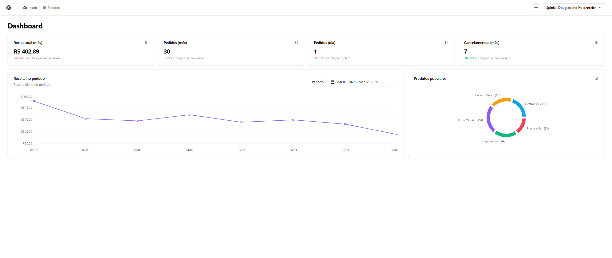
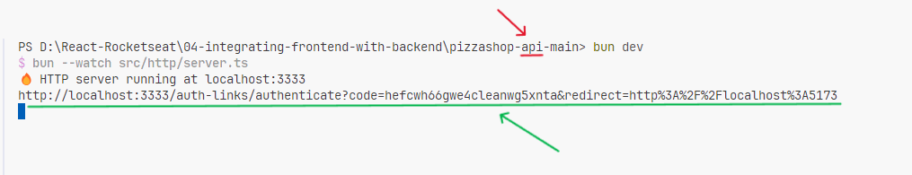
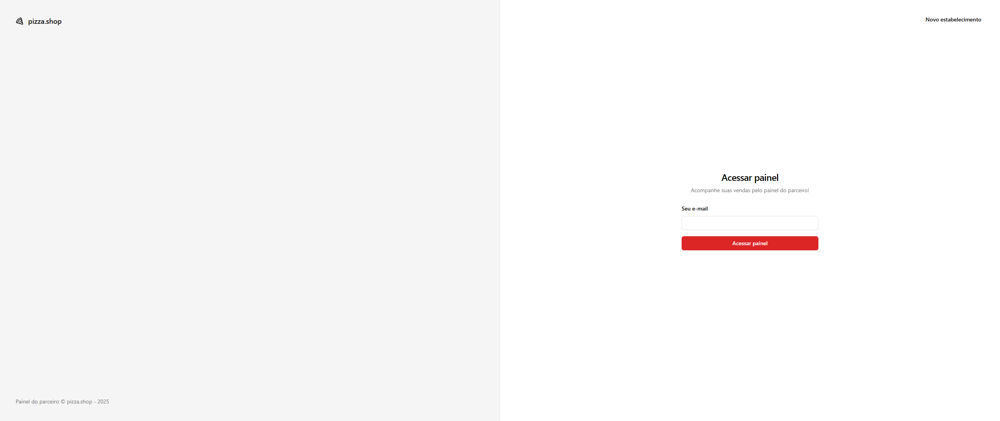
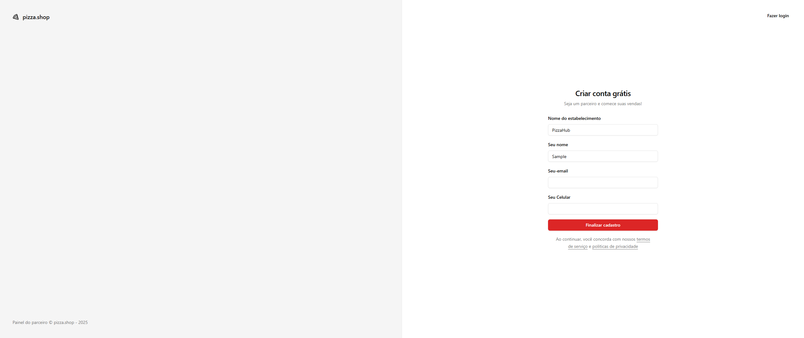
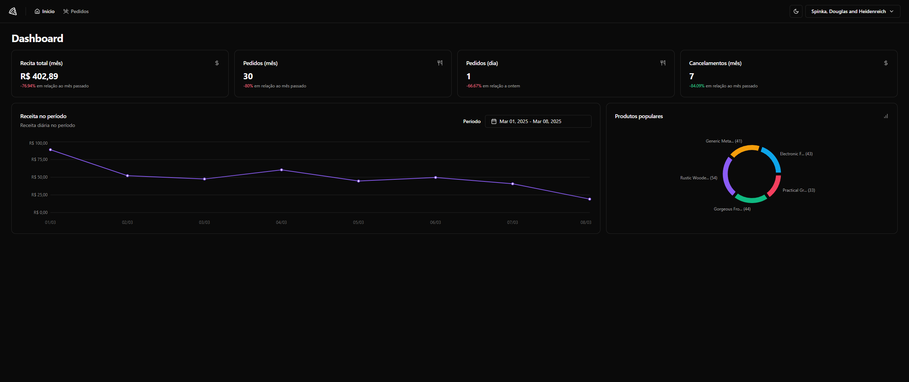
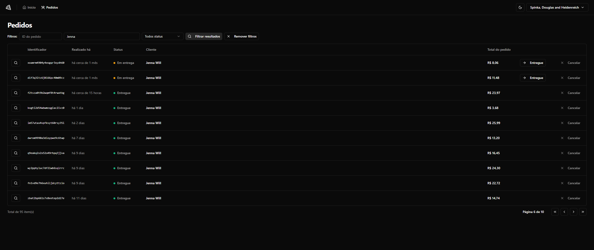
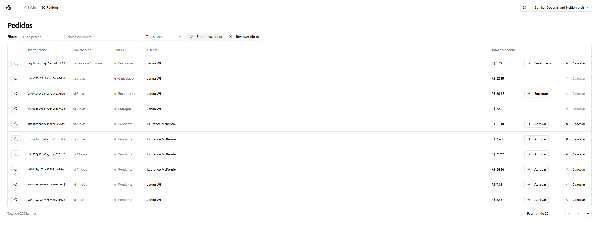
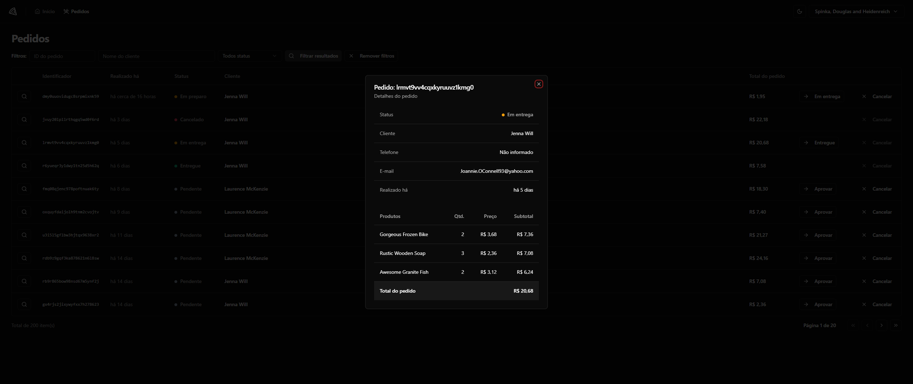
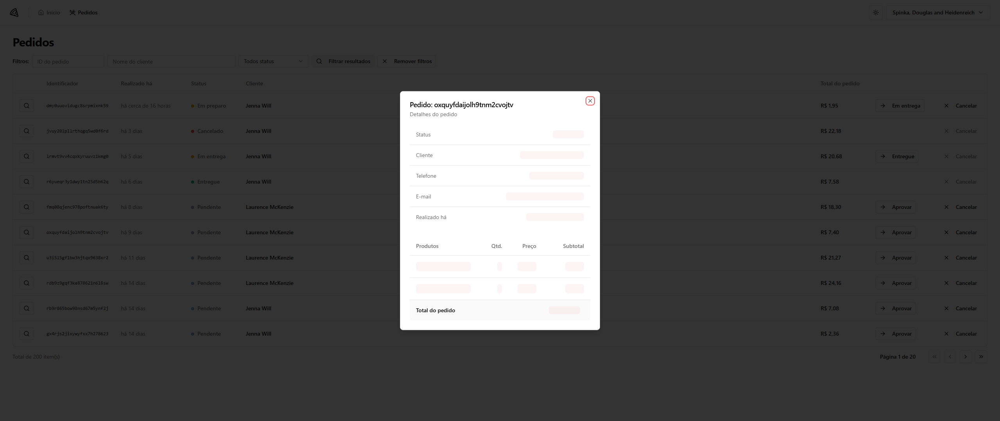
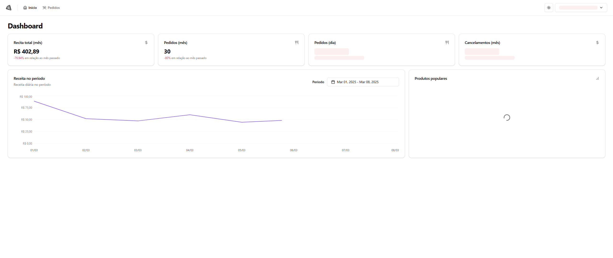

# Pizza shop



## Getting starter

**1. Set up the API:**
Get the pre-configured API and follow the setup instructions at: https://github.com/rocketseat-education/pizzashop-api

**2. Start the project with Vite:**
Run the following command in your terminal:

```bash
   npm run dev
```

**3. Log in:**
Use the pre-populated email to sign in: `diego.schell.f@gmail.com`

Note: You can also sign up with a different email, but the dashboard will be empty.

**4. Access the dashboard:**
login link will be printed in the API terminal. Copy and open it in your browser to access the application.



## Screenshots









