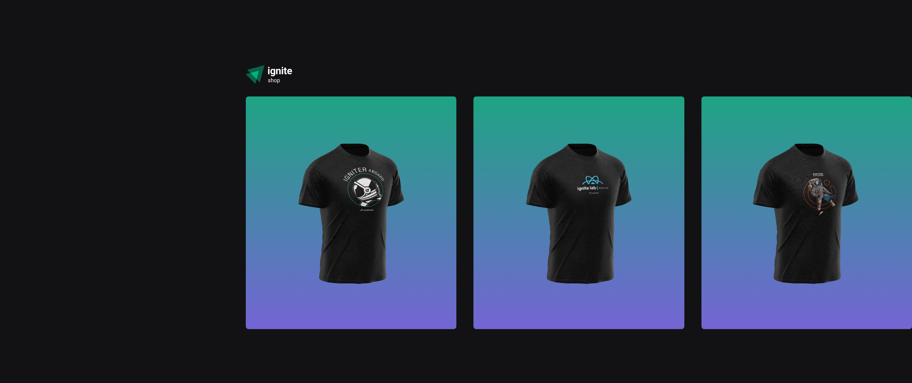

# Ignite shop




Stripe payment gateway


## Getting starter

**1. Setup environment variables**
Check the **stripe** documentation if you need: https://docs.stripe.com/keys

```env
   STRIPE_PUBLIC_KEY=
   STRIPE_SECRET_KEY=

   NEXT_URL=http://localhost:3000
```

**2. Run**

```bash
   npm run dev
```
