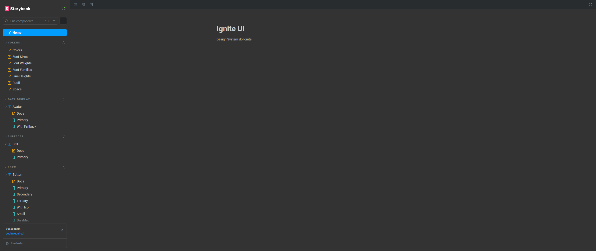

# Design System




## Docs

### Getting starter

**1. Install dependencies:**

```bash
   cd level-six
   npm install
```

**2. Build:**

```bash
   npm run build
```

**3. Design system docs:**

```bash
   cd packages/docs
   npm run storybook
```
